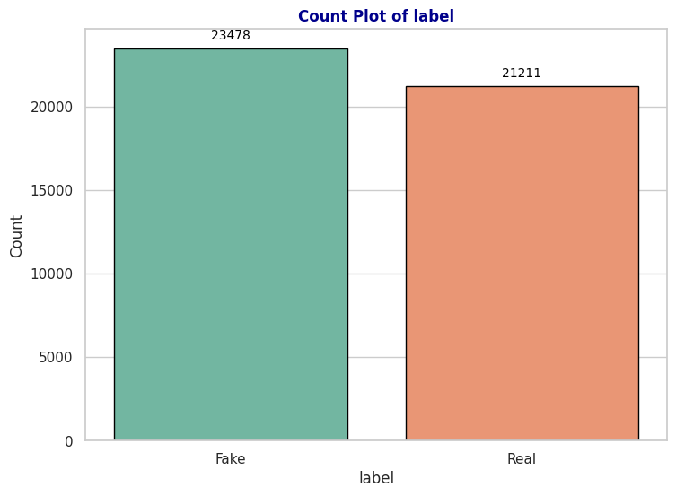
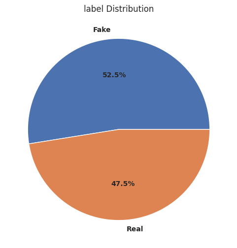

#  Fake News Detection using LSTM
 

## Background
information spreads rapidly through various online platforms. However, not all disseminated **information is factual**, and the **spread of fake news** poses a significant challenge, negatively impacting individuals and society. To address this issue, technologies like **deep learning**, particularly **Long Short-Term Memory (LSTM)**, can be utilized to analyze and classify news based on its authenticity. LSTM is chosen for its superior ability to process text data and identify patterns in sequential data.
This **project aims** to **develop an LSTM-based machine learning model** capable of automatically **detecting and classifying fake news**. The project seeks to **assist individuals and digital platforms** in filtering out false information and enhancing trust in credible news sources.

## Preprocessing Text
### Workflow for Preprocessing Text:
- Case Folding & Cleaning Text
- Stopwords & Stemming

## Exploratory Data Analysis
### 1.  What Happened?

The dataset contains **23478 instances (52.5%) labeled as "Fake News"** and **21211 instances (47.5%) labeled as "Real News"**.

### 2. What the most type of news is real or fake?

- The category with the **most fake news** is **News** with **9,050** fake articles, followed by **politics** with **6,838** fake articles.
- The category with the **most real news** is **politicsNews** with **11,220** real articles, followed by **worldnews** with **9,991** real articles.

### 3. What words frequently appear in the reviews?

"trump", "said", "state", "presid" (likely stemming from "president"), and "would."
These words suggest a strong focus on political events and statements, particularly involving the U.S. presidency.

### 4. What words often appear in fake news?

"trump," "ame" (possibly stemming from "America"), "presid" (likely "president"), "like," "clinton," and "peopl."
These words indicate a significant focus on political figures and events, often involving controversial or polarizing topics, which are common in fake news narratives.

### 5. What words often appear in real news?

"reuter" (likely referring to Reuters, a reputable news agency), "republican," "presid" (likely "president"), "trump," "state," and "said."
These words reflect a focus on official reports, political figures, and statements, which are characteristic of real news articles based on credible sources and factual reporting.

## Feature Extraction
I did **Label-Encoder** & **keras-tokenizer** method on feature extraction.

## Modeling
### Model Architecture

## Evaluation
### Model Accuracy over epochs

- The image indicates that the model learns patterns effectively and does not overfit.
### Model Loss over epochs

- The image indicates that the model learns patterns effectively and does not overfit.
### Confusion Matrix

### Metrics Evaluation

### The performance of the LSTM-based model can be summarized as follows:
- Precision: The model achieved a precision of 0.99 for both fake news (class 0) and real news (class 1). This means that the model is highly accurate in identifying true positives, with very few false positives.
- Recall: The recall score is also 0.99 for both fake and real news, indicating that the model is effectively identifying almost all of the fake and real news instances, with very few false negatives.
- F1-Score: The F1-score for both classes is 0.99, suggesting a good balance between precision and recall. This indicates that the model is consistently performing well for both types of news.
- Accuracy: The overall accuracy of the model is 99%, which reflects the model's excellent performance in correctly classifying news articles as real or fake.

## Conclusion
The model demonstrates outstanding performance in classifying news articles with a very high accuracy of 99%. Both the precision and recall values being so close to 1 across the board show that the LSTM-based fake news detection model is highly reliable and effective in distinguishing between real and fake news. This model can be effectively used to automatically detect and filter out fake news, promoting a more informed digital ecosystem.
